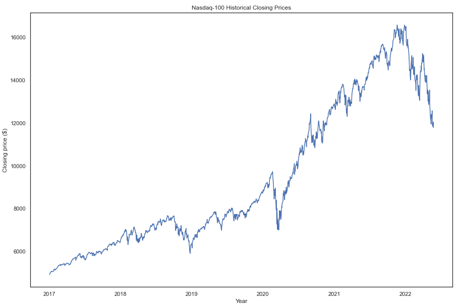
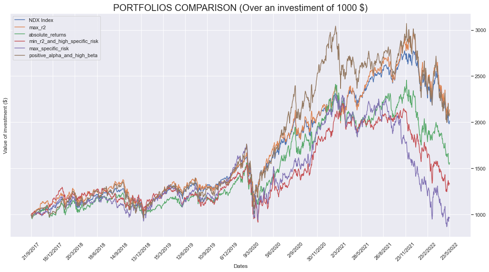

# Portfolio Building
2021/22 Financial Market Analytics project @ University of Milano-Bicocca

## Team
* Mirko Tritella (887196)
* Aurora Cerabolini (839327)
* Paolo Comensoli (883147)

## Introduction 
In this group project, we want to understand what are the structural characteristics that risk brings to real investment portfolios. For this reason, we need to build real portfolios that are focused on a specific level and type of risk. A portfolio is a collection of individual assets or securities and investors seek to diversify it instead of investing all of their wealth in a single or a few assets. With diversification, investors decrease the level of risk, in fact they want to maximize their return with less risk on their investment in a portfolio. To investigate the level of risk of individual stocks, we rely on the Single Index (beta) Model (SIM), proposed by William Sharpe in 1963, and then proceed to group the securities based on common characteristics in order to study them.

### Single Index Model

Efficient portfolio construction with minimal risk for a given expected return can be achieved with the use of the Single Index Model proposed by Sharpe. The Single Index Model is based on the assumption that the fluctuations in the value of stock relative to other stocks do not depend on the characteristics of those securities alone. Relationships between securities occur only through their individual relationships with some indexes of business activity. Our index will be the Nasdaq-100. The equation of the Single Index Model links the returns of a single stock with the returns of the market index
$r_i =α_i+β_i(R_M)+ε_i$
In this linear equation we have:
* $r_i$ expected return on security i
* $R_M$ is the return of the market
* $α$ is the intercept of the straight line or alpha coefficient: α is often referred to as ”excess return” and it measures the performance of an investment against a market index or benchmark that is believed to represent the movement of the market as a whole.
* $β_i$ is the slope of the straight line or beta coefficient: beta is a measure of the volatility, or systematic risk, of a security or portfolio relative to the market as a whole.
* $ε_i$ is the error term with the mean of zero and a standard deviation which is a constant.

The variance of the security has two components namely systematic risk, or market risk, and unsystematic risk, or specific risk. The variance explained by the index is referred to as systematic risk and the unexplained variance is called residual variance or unsystematic risk.

$SystematicRisk = β^2_iσ_M^2$

$UnsystematicRisk = TotalVariance − SysmtematicRisk$

### Benchmark Index
The Nasdaq-100 (NDX) is one of the world’s leading indices by capitalization. It includes 100 of the largest national (US) and international non-financial companies listed on the Nasdaq stock market by market capitalization. Within this index we find some of the major technology companies such as Apple, Amazon, Aphabet (Google), Facebook and Microsoft. The Nasdaq-100 undergoes quarterly reviews that occur in March, June, September and December and become effective with the closing values on the third Friday of the month. To become part of this index, stocks must have a daily trading volume of at least 200,000 pieces, have a total average market capitalization equal to or greater than 0.1% of the average market capitalization of the Nasdaq-100 stocks and typically must have been listed for at least a couple of years.

### Dataset
At this time (July 2022) there are 102 stocks within the Nasdaq-100. The complete list can be viewed here: [Nasdaq-100](https://www.nasdaq.com/market-activity/quotes/nasdaq-ndx-index). For the construction of the dataset, we downloaded the daily closing prices of these securities and of all those securities that were part of the index starting from 2017 (beginning of our historical series). We then managed the revisions of the securities by finding the incoming securities, the outgoing securities, and the effective date of exchange on the official Nasdaq website. We used the Bloomberg terminal to download the data.
When building the dataset we put attention to the survivorship bias. The survivorship bias indicates the tendency to consider only existing or ”survivors” or ”winners” stocks when measuring the performance of a portfolio. This is a bias linked to the ”sample selection” in which observations that have already ceased to exist are not considered. For this reason, a portfolio’s return may be overestimated, leading to overly optimistic conclusions. To avoid survivorship bias, we need to make sure that all data is present and that no longer present observations have not been omitted. To create a dataset that takes into account the revisions that took place during the analysis period, we also downloaded the historical series of daily prices even for those stocks that are no longer part of the index, but that are still within the U.S. stock market. By checking the date on which a certain change took place, indicated by X, between a security A (incoming) and B (outgoing), we set to #N/A all the cells of B starting from X, valued the cells of A starting from X and setting to #N/A all cells of A prior to X. In these 5 years that we are analyzing, it can happen that a stock was removed from the Nasdaq-100. We also had to look up the prices of those stocks that are no longer listed. In this case we had to consider the sale price or what was obtained from a merge.

<u>*Please consult the report for details!*</u>

## License
[MIT](https://choosealicense.com/licenses/mit/)